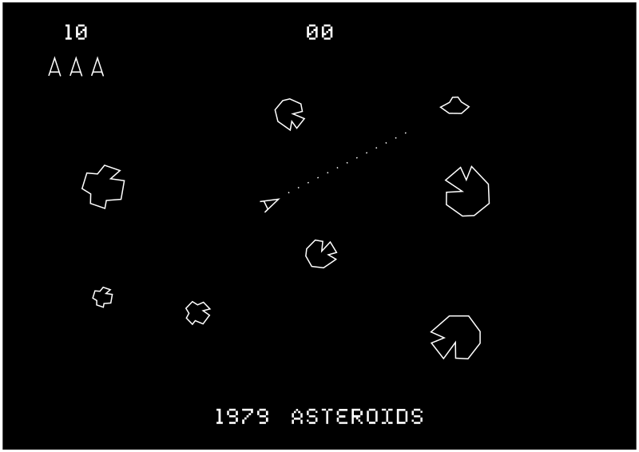
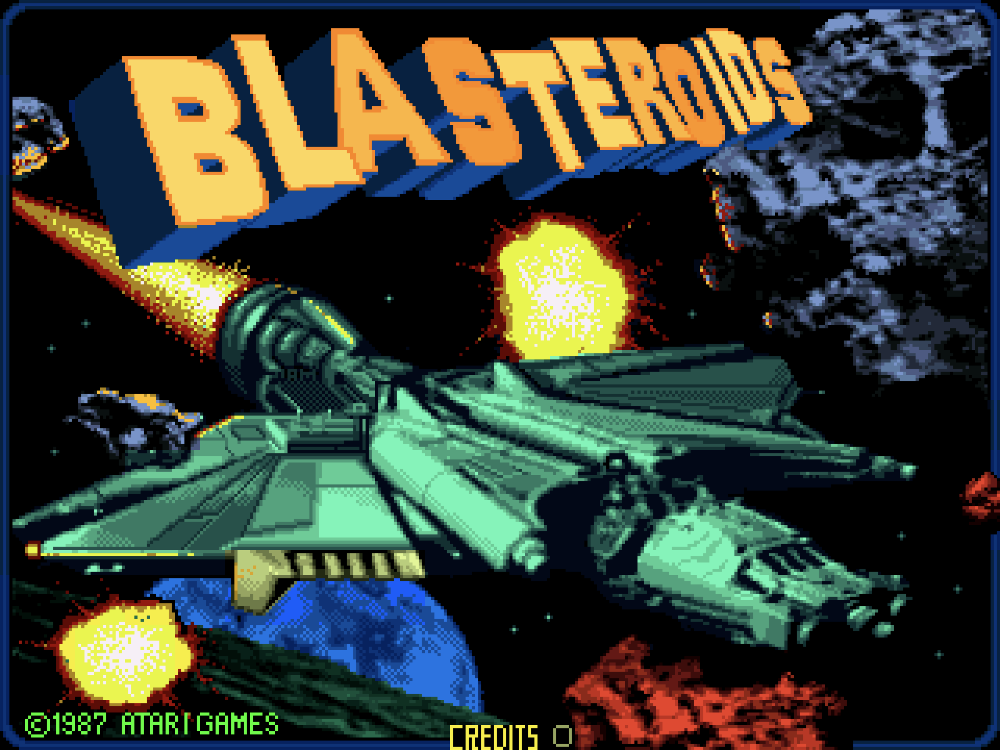
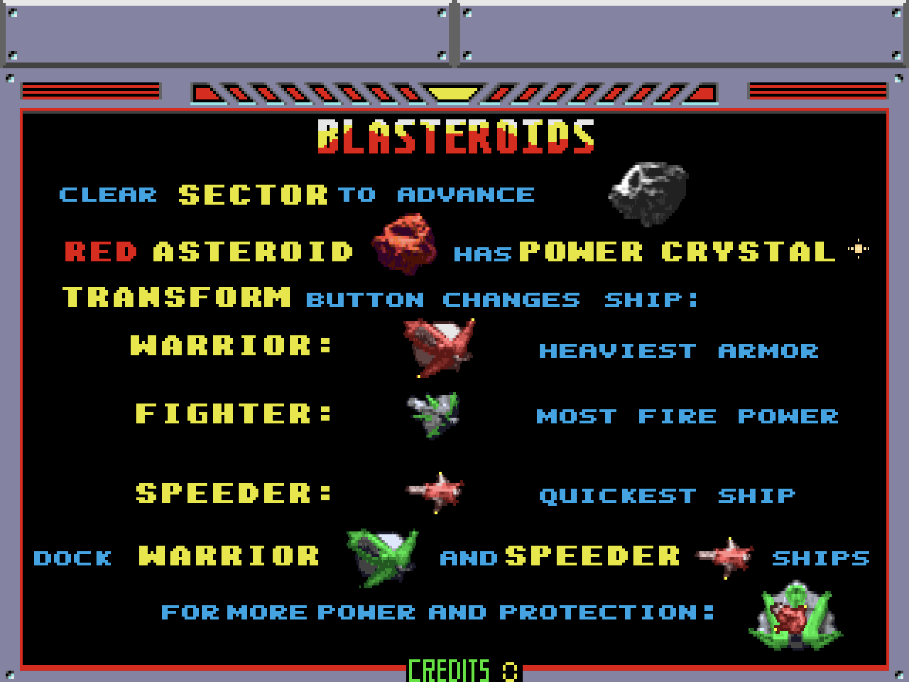
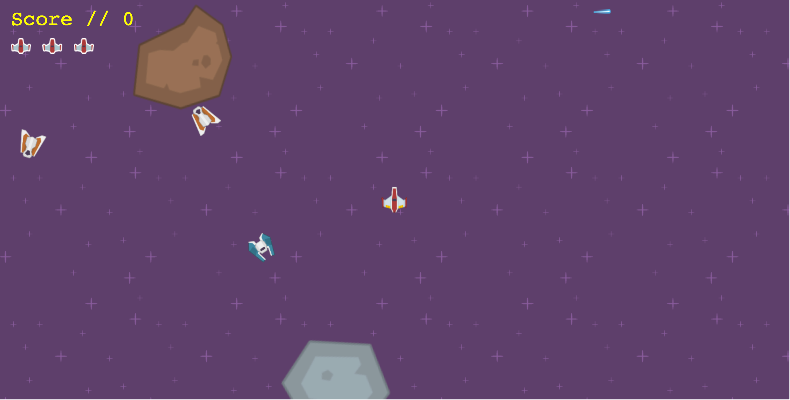

      
[

About `Blasteroids`
-------------------

	<a href="https://en.wikipedia.org/wiki/Asteroids_%28video_game%29">Asteroids</a> is an arcade space shooter released in November 1979 by <a href="https://en.wikipedia.org/wiki/Atari,_Inc.">Atari, Inc.</a> and designed by Lyle Rains, Ed Logg, and Dominic Walsh. The player controls a spaceship in an asteroid field which is periodically traversed by flying saucers.  The object is to shoot and destroy both asteroids and saucers alike, while avoiding each of them, as well as the flying saucers' counter-fire. The difficulty increases as the number of asteroids increases.

	<a href="https://en.wikipedia.org/wiki/Asteroids_%28video_game%29">Asteroids</a> was one of the first major hits of the golden age of arcade games.

    <a href="https://en.wikipedia.org/wiki/Blasteroids">Blasteroids</a> is the third official sequel to the 1979 shoot 'em up video game Asteroids. It was developed by Atari Games and released as a coin-operated game in 1987. Unlike the previous games, Blasteroids uses raster graphics, not vector graphics.  Various computer ports of Blasteroids were released by Image Works.

### Blasteroids Game Play

    The gameplay for Blasteroids is basically the same as for the original; the player controls a spaceship viewed from "above" in a 2D representation of space, by rotating the ship, and using thrust to give the ship momentum. To slow down or completely stop moving, the player has to rotate the ship to face the direction it came from, and generate the right amount of thrust to nullify its momentum. 

    The ship has a limited amount of fuel to generate thrust with. This fuel comes in the form of "Energy" that is also used for the ship's Shields which protect it against collisions and enemy fire. Once all Energy is gone, the player's ship is destroyed.

    The ship can shoot to destroy asteroids and enemy ships. The ship can also be transformed at will into 3 different versions, namely the "Speeder", the fastest version, the "Fighter", which has the most firepower, and the "Warrior", which has extra armour.

### Blasteroids Objective

    The object of the game is to destroy all the asteroids which have a set speed at which they fly through the Sector.

    Asteroids come in varying sizes, and when shot, larger asteroids break into multiple smaller ones. Only shooting the smallest ones will actually remove them from the Sector. Asteroids also come in different types. Normal asteroids don't contain anything, but red asteroids can contain power-ups in the form of Power Crystals that are released by completely destroying asteroids. Crystals decay over time. Popcorn Asteroids require several hits, which expands their size, and eventually makes them stop spinning. They can't be destroyed, but stopping them is enough to finish each Sector. Egg asteroids contain leeches which home in on the user's ship and suck out its energy. They can be shot and destroyed. Finally there are Seeker asteroids which home in on the player's ship after being shot.

    Besides asteroids, there are different enemy ships trying to shoot the player, which leave equipment in the form of power-ups when destroyed.

<!--
There are different kinds of equipment:

Shields - give limited amount of protection, indicated in HUD.
Blasters - gives the ship double shots.
Extra Shot Power - allows shots to penetrate everything.
Ripstar - when activated, causes the ship to spin furiously, firing in all directions.
Extra Fuel Capacity - increases fuel capacity, indicated by the HUD. Depleting fuel reserves to critical with this increased capacity will revert the ship to normal fuel capacity.
Booster - increases movement speed for all ship forms.
Crystal Magnet - attracts loose Power Crystals to the ship.
Cloak - ship turns invisible to enemies, preventing them from detecting the ship.
Boss
Mukor is the alien boss after all sectors are cleared of asteroids. He will try to ram the player and will send miniature enemy ships to aid him. Mukor has tentacles which all must be shot multiple times to be destroyed. Once all tentacles are gone, Mukor is defeated and he will leave some special equipment. He will reappear in the next Galaxy with a larger number of tentacles, making him harder to defeat. Mukor must be defeated in all Galaxies to be fully conquered and for the player to win the game.

Multiplayer
A second player can join the game at any time by pressing his Fire button, using up 1 credit and turning Blasteroids into a multiplayer game. Both players can cooperate by covering each other, as well as by docking their ships into the Starlet. Docking is possible if one ship is a Speeder, and the other is a Warrior; flying over each other will turn the Speeder into a stationary Turret with more firepower, on top of the Warrior, which turns into a Spiaret, with less firepower but full control. The ships undock when either player transforms their ship into something else again. The first player to exit through the Exit Portal gets a large bonus and control of the Galactic Map.
-->

	This <code>Blasteroids</code> is a Blasteroids clone built purely using HTML, CSS, and JavaScript.  <code>Blasteroids</code> was designed as an entry level introduction into both <strong>Web Programming</strong> and <strong>Game Programming</strong>. Its source code, its comments and its documentation are <strong><em><u>FREE</u></em></strong> to everyone.

#### Our Objective

The primary objectives of this <code>Blasteroids</code> are... 
	<ul class="list-group">
		<li class="list-group-item">...to avoid blasteroids at all costs,</li>
		<li class="list-group-item">...to avoid enemy ships at all costs,</li>
		<li class="list-group-item">...to destroy as many blasteroids as possible,</li>
		<li class="list-group-item">...to destroy enemy ships (only if they shoot first),</li>
		<li class="list-group-item">...to reach the highest level possible,</li>
		<li class="list-group-item">...and to earn the highest score.</li>
	</ul>
	

		The player must do all of this while traversing levels of increasingly difficulty. 
	
		

	

		The player pilots a <em><u>state of the art</u></em>, computer generated, very pixelated ship that comes with zero guarantees.  It does however come with an infinite supply of laser blasts. The ship can also...
	

	<ul class="list-group">
		<li class="list-group-item">...rotate left,</li> 
		<li class="list-group-item">...rotate right,</li>
		<li class="list-group-item">...fire shots straight forward,</li>
		<li class="list-group-item">...and thrust forward.</li>  
	</ul>

#### Underpinnings

<code>Blasteroids</code> is built using the following libraries:
<ul class="list-group">
	<li class="list-group-item"><a href="https://github.com/hecht-software/box2dweb">Box2dWeb</a> - a JavaScript physics engine</li>
	<li class="list-group-item"><a href="https://github.com/incompl/boxbox/">boxbox</a> - a wrapper framework for the Box2d / Box2dweb physics engine</li>
	<li class="list-group-item"><a href="https://jquery.com/">jQuery</a> - a fast, small, and feature-rich JavaScript library</li>
	<li class="list-group-item"><a href="https://github.com/daneden/animate.css">Animate.css</a> - a cross-browser library of CSS animations</li>	
</ul>

plus, its own custom libraries:
<ul class="list-group">
	<li class="list-group-item">{@link Audio}</li>
	<li class="list-group-item">{@link Log}</li>
</ul>

and some utility methods in:
<ul class="list-group">
	<li class="list-group-item">{@link BoxBoxUtil}</li>
</ul>

#### Legal Stuff

This version of <code>Blasteroids</code> is a clone of Ed Rotberg's Blasteroids of 1987.

	

		<code>Blasteroids</code> is designed as an entry level introduction into both <strong>Web Programming</strong> and <strong>Game Programming</strong>.  Its source code and documentation are <strong><em><u>FREE</u></em></strong> to everyone, forever, in perpetuity, until the end of the universe.
	

	

		<code>Blasteroids</code> is distributed under a short and simple permissive license with conditions only requiring preservation of copyright and license notices. Licensed works, modifications, and larger works may be distributed under different terms and without source code.  <code>Blasteroids</code> is <strong>free</strong> software, licensed under the MIT License(the "License"). Commercial and non-commercial use are permitted in compliance with the License.
	

Copyright (c) 2017-present by Richard Franks Jr richardfranksjr@hotmail.com and the contributors to Blasteroids. All rights reserved.

#### Contributing

Want to contribute to <code>Blasteroids</code>? Please read {@tutorial CONTRIBUTING}.

Installation and Usage
----------------------

#### Prerequisites

	Running <code>Blasteroids</code> requires both <a href="https://nodejs.org/">NodeJS</a> and <a href="https://www.npmjs.com/">npm</a>.

#### Running

	<code>Blasteroids</code> comes ready to run, out of the box, no building required.
	To rebuild the documentation, in case you have made changes, and start the server, run

    npm run serve
    

	If you are on a Mac, you can use

    
    npm run serve-macosx

You should see something similar to the following.

	
    Richards-MacBook-Pro:blasteroids rfranks$ npm run serve

	> blasteroids@0.0.1 serve /Users/rfranks/Developer/Code/blasteroids
	> npm install && ./build-doc.sh && ./node_modules/.bin/http-server

	audited 100 packages in 1.101s
	found 0 vulnerabilities

	Removing Documentation Directory[./doc]...
	Building Documentation using jsDoc...
	Parsing /Users/rfranks/Developer/Code/blasteroids/js/conf/options.config.js ...
	Parsing /Users/rfranks/Developer/Code/blasteroids/js/conf/powerups.config.js ...
	Parsing /Users/rfranks/Developer/Code/blasteroids/js/game/entities.js ...
	Parsing /Users/rfranks/Developer/Code/blasteroids/js/game/game.js ...
	Parsing /Users/rfranks/Developer/Code/blasteroids/js/lib/audio.js ...
	Parsing /Users/rfranks/Developer/Code/blasteroids/js/lib/boxbox-util.js ...
	Parsing /Users/rfranks/Developer/Code/blasteroids/js/lib/log4.js ...
	Parsing /Users/rfranks/Developer/Code/blasteroids/js/lunr.search.js ...
	Parsing /Users/rfranks/Developer/Code/blasteroids/js/public-lib/boxbox.doc.js ...
	Parsing /Users/rfranks/Developer/Code/blasteroids/js/public-lib/docstrap.min.js ...
	Parsing /Users/rfranks/Developer/Code/blasteroids/js/public-lib/lunr.min.js ...
	Parsing /Users/rfranks/Developer/Code/blasteroids/js/sunlight.js ...
	Parsing /Users/rfranks/Developer/Code/blasteroids/js/toc.js ...
	Generating output files...
	Finished running in 1.84 seconds.
	...Done!
	Starting up http-server, serving ./
	Available on:
	  http://127.0.0.1:8080
	  http://10.0.0.182:8080
	Hit CTRL-C to stop the server

Press <code>CTRL-C</code> to stop the server when you have finished running <code>Blasteroids</code>.
	

    Browse to <a href="http://127.0.0.1:8080/">http://127.0.0.1:8080/</a> to start playing!

#### Project Structure
|  Approx Size | Folder                            |        File Type        | Contents                                                                                                                            |
|:------------:|-----------------------------------|:-----------------------:|-------------------------------------------------------------------------------------------------------------------------------------|
|     220K     | `./blasteroids/css/doc`           |           css           | css stylesheets specific to the game's documentation                                                                                |
|     320K     | `./blasteroids/css`               |           css           | core css stylesheets                                                                                                                |
|      44K     | `./blasteroids/images/background` |        image/png        | background images for the game's canvas                                                                                             |
|     756K     | `./blasteroids/images/doc`        |        image/png        | images used in the game's documentation                                                                                             |
|     1.5M     | `./blasteroids/images`            |        image/png        | images used in the game or the game's documentation                                                                                 |
|     800K     | `./blasteroids/js/public-lib`     |            js           | 3rd party JavaScript libraries used by the game or the game's documentation (like jQuery, DocStrap or boxbox)                       |
|      68K     | `./blasteroids/js/game`           |            js           | javascript files used in the game (like the entities within the game)                                                               |
|      48K     | `./blasteroids/js/lib`            |            js           | core utility libraries used by the game or the game's documentation                                                                 |
|      20K     | `./blasteroids/js/conf`           |            js           | configuration js files                                                                                                              |
|     992K     | `./blasteroids/js`                |            js           | javascript files used in the game or the game's documentation                                                                       |
|     3.0M     | `./blasteroids/sounds`            |           wav           | sounds used within the game                                                                                                         |
|     8.0K     | `./blasteroids/static`            |            -            | just that, noise... can we remove?  required by jsdoc?                                                                              |
|     100K     | `./blasteroids/templates`         |           tmpl          | template files for the documentation ui (used during the JSDoc publish action)                                                      |
|      32K     | `./blasteroids/tutorials`         |         markdown        | markdown documents that correspond to  the tutorials in the game's documentation,  such as How To Play, or even the Code of Conduct |
|     220K     | `./blasteroids/fonts`             |  eot/svg/ttf/woff/woff2 | fonts used by the game or the game's documentation                                                                                  |
| 6.2M (total) | `./blasteroids`                   |            *            | all of the games files                                                                                                              |

How to Play
-----------

For details on how to play <code>Blasteroids</code>, see {@tutorial HOW_TO_PLAY}.

Development and design
----------------------

This version of <code>Blasteroids</code> is in no way related to or derived from Ed Rotberg's 1987's Blasteroids.

<code>Blasteroids</code> was designed as an entry level introduction into both <strong>Web Programming</strong> and <strong>Game Programming</strong>. Both its source code and documentation are <u>FREE</u> to everyone.

##### Reception

To be determined. ;-)

Attributions
------------

<code>Blasteroids</code> uses the great sounds provided free of charge from <a href="https://www.NoiseForFun.com" target="_blank">NoiseForFun.com</a>. Please visit and donate! :-)

<code>Blasteroids</code> also uses the <a href="https://www.kenney.nl/assets/space-shooter-redux" target="_blank">Space Shooter Redux</a> assets library from <a href="https://www.kenney.nl" target="_blank">Kenney.nl</a>.  Please visit and donate! :-)

For More Information
--------------------

+ TODO.
+ TODO.
+ Post questions tagged `blasteroids` to [Stack
Overflow](http://stackoverflow.com/questions/tagged/blasteroids).

License
-------

<code>Blasteroids</code> is <strong>free</strong> software, licensed under the MIT License(the "License"). Commercial and non-commercial use are permitted in compliance with the License.

Copyright (c) 2017-present by Richard Franks Jr richardfranksjr@hotmail.com and the contributors to Blasteroids. All rights reserved.

The source code for <code>Blasteroids</code> is available at [GitHub](https://github.com/rfranks/blasteroids).

<code>Blasteroids</code> is distributed under a short and simple permissive license with conditions only requiring preservation of copyright and license notices. Licensed works, modifications, and larger works may be distributed under different terms and without source code.

		
| Permissions  | Conditions| Limitations  |
|:-------------|:----------|:-------------|
|Commercial use| License and copyright notice | Liability |
|Distribution| | Warranty |                            
|Modification|  |  |
|Private use|  | &nbsp; |                          

### MIT License

	

		Copyright (c) 2017-present Richard Franks Jr richardfranksjr@hotmail.com
	

	

		Permission is hereby granted, free of charge, to any person obtaining a copy
		of this software and associated documentation files (the "Software"), to deal
		in the Software without restriction, including without limitation the rights
		to use, copy, modify, merge, publish, distribute, sublicense, and/or sell
		copies of the Software, and to permit persons to whom the Software is
		furnished to do so, subject to the following conditions:
	

	

		The above copyright notice and this permission notice shall be included in all
		copies or substantial portions of the Software.
	

	

		THE SOFTWARE IS PROVIDED "AS IS", WITHOUT WARRANTY OF ANY KIND, EXPRESS OR
		IMPLIED, INCLUDING BUT NOT LIMITED TO THE WARRANTIES OF MERCHANTABILITY,
		FITNESS FOR A PARTICULAR PURPOSE AND NONINFRINGEMENT. IN NO EVENT SHALL THE
		AUTHORS OR COPYRIGHT HOLDERS BE LIABLE FOR ANY CLAIM, DAMAGES OR OTHER
		LIABILITY, WHETHER IN AN ACTION OF CONTRACT, TORT OR OTHERWISE, ARISING FROM,
		OUT OF OR IN CONNECTION WITH THE SOFTWARE OR THE USE OR OTHER DEALINGS IN THE
		SOFTWARE.
	

Code of Conduct
---------------

	Please note that this project is released with a Contributor {@tutorial CODE_OF_CONDUCT}.  
	By participating in this project you agree to abide by its terms.

